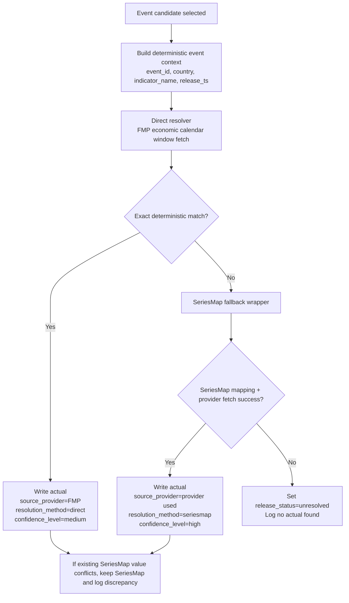

# Hybrid Actuals Architecture v1.0

## Objective

Introduce a deterministic hybrid actuals resolver that:

1. Resolves released values directly from provider metadata first
2. Falls back to the existing SeriesMap path only when direct resolution fails
3. Records source attribution on every resolved actual
4. Preserves SeriesMap precision as the strongest path

## Flow Diagram

## Deterministic Matching Rules

The direct path is intentionally strict.

- `country` must match exactly after uppercase normalization.
- `release_ts` must fall within a fixed window of the provider event timestamp.
- `indicator_name` must match by one of:
- exact normalized title equality
- exact normalized equality after stripping date suffixes and release-stage tokens
- exact match through a predefined alias table

No LLMs, embeddings, similarity search, or probabilistic ranking are used.

## Function-Level Architecture

### Direct resolver module

File: `apps_script/actuals_direct_resolver.js`

- `ensureActualsAuditHeaders_(sh)`
  Appends `resolution_method` and `confidence_level` to the Event sheet header contract.
- `_resolveActualHybrid_(event, seriesMap, logSheet)`
  Orchestrates direct-first, SeriesMap-second resolution.
- `_resolveActualDirect_(event, logSheet)`
  Executes deterministic provider-based resolution from FMP calendar data.
- `_fmpFetchCalendarForEvent_(event)`
  Fetches and caches a narrow provider window around `release_ts`.
- `_matchDirectActualCandidate_(event, rows)`
  Applies exact country, normalized title, and timestamp-window rules.

### Fallback resolver module

File: `apps_script/actuals_direct_resolver.js`

- `_resolveActualViaSeriesMapFallback_(event, seriesMap, logSheet, directAttempt)`
  Wraps the existing SeriesMap resolver and existing provider fetcher without changing their internals.

### Existing fetch worker

File: `apps_script/actuals_fetcher.js`

- `runFetchActualsWindow_(...)`
  Now calls `_resolveActualHybrid_(...)` for each event candidate.
  It writes:
  - `source_provider`
  - `source_series_id`
  - `transform`
  - `release_status`
  - `resolution_method`
  - `confidence_level`

## Separation Of Concerns

- Direct resolution is isolated from SeriesMap logic.
- SeriesMap remains the precision fallback and keeps its internal matching/fetch logic unchanged.
- Logging is centralized through the existing `_log_` / `appendLog` path.
- Provider data fetching is cached at the direct resolver window level to reduce duplicate FMP calls.

## Conflict Handling

- Existing SeriesMap-resolved actuals are treated as higher confidence.
- If a new direct result conflicts with an existing SeriesMap value, the system keeps the SeriesMap value and logs the discrepancy.
- If both direct and fallback fail, the row is marked `unresolved` and no actual value is assigned.

## Backward Compatibility

- No global Apps Script function names were renamed.
- Existing SeriesMap resolution functions were not modified.
- Event headers remain append-only.
- Existing `source_provider` and `source_series_id` semantics remain intact.

## Audit Fields

Each resolved actual now records:

- `source_provider`
- `resolution_method`
- `confidence_level`

Resolution-level logs include:

- `event_id`
- `resolution_path`
- `provider`
- `success`
- `reason`
- `fallback_triggered`
